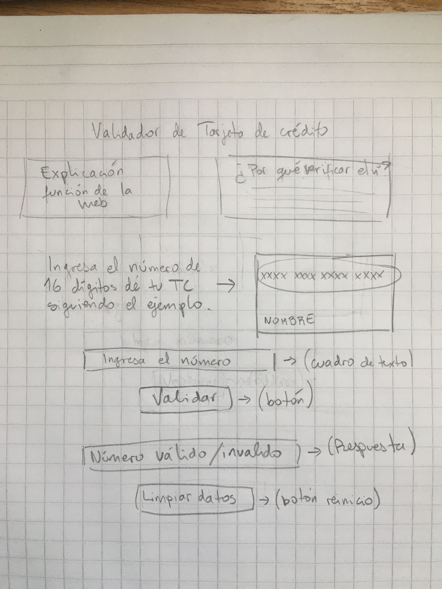

# Validador de Tarjeta de Crédito

## Índice

* [1. Resumen](#1-resumen)
* [2. Vista final del validador](#2-vista-final-del-validador)
* [3. Investigación UX](#3-investigacion-ux)

***

## 1. Resumen

Este proyecto consistió en crear una aplicación web que le permita a un usuario validar el número de una tarjeta de crédito, mediante el algoritmo de Luhn. Además, implementa una funcionalidad para ocultar todos los dígitos de la tarjeta, menos los últimos cuatro.

## 2. Vista final del validador

## 3. Investigación UX
  
#### Objetivo y usuarios del producto: 
  Validar el número de cualquier tarjeta de crédito, para cualquier usuario que desee saber si su tarjeta es válida.

#### Importancia del producto: 
  Actualmente, existe mucha oferta para obtener una tarjeta de crédito digital. Esto lo ofrecen muchos sitios que no sabemos si realmente son fiables y si lo que nos otorgan es una tarjeta de crédito válida para utilizar. 
  Este producto ofrece a cualquier usuario, que tiene dudas sobre su nueva tarjeta, la oportunidad de verificarla antes de utilizarla.

#### Primer prototipo:

  Luego de presentar mi prototipo a mi squad, me dieron las sugerencias de indicar en alguna parte de mi página que el sitio es seguro y, eventualmente, incorporar algo que haga mención a la marca de la tarjeta. 
  Ambas ideas me parecieron excelentes aportes para mi producto, por lo que quise incorporar las dos en un inicio, pero finalmente me decidí por omitir la marca de la tarjeta, ya que no me alcanzaría el tiempo y se alejaba un poco de mi objetivo principal.

#### Imagen del prototipo final:
 
  
### END.
